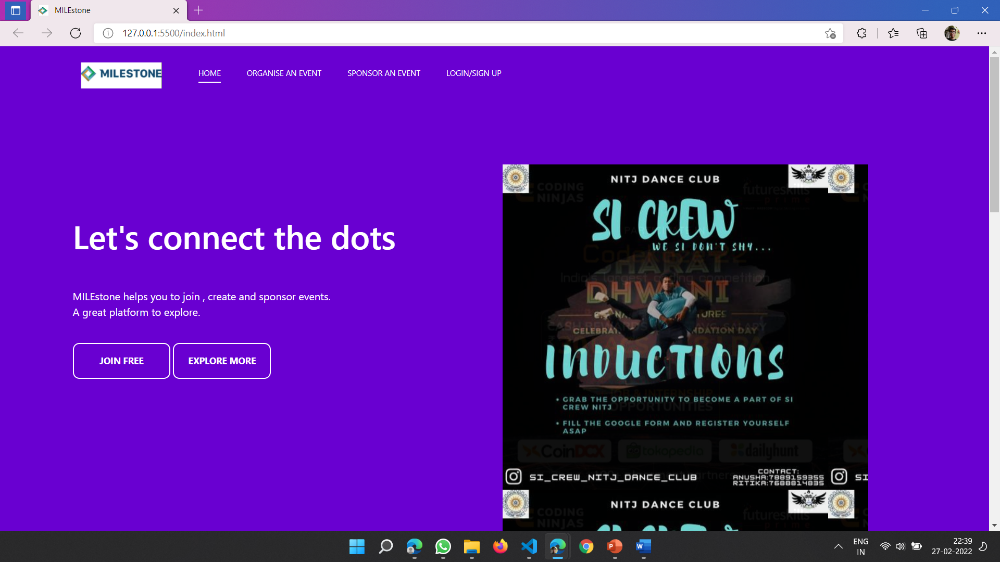
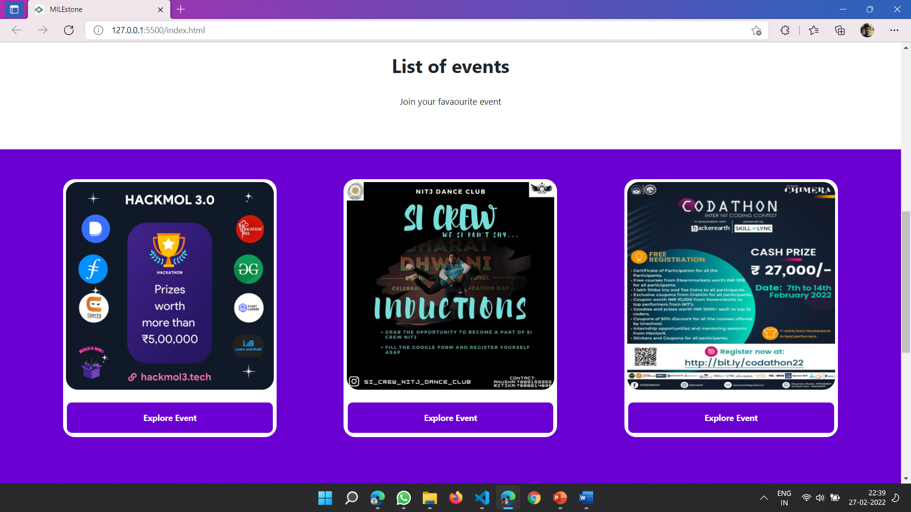
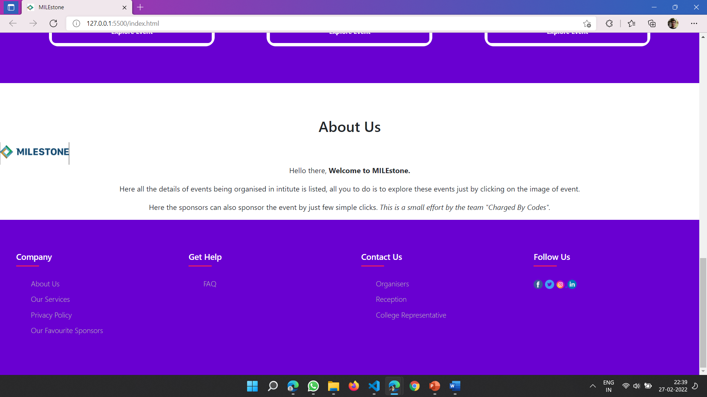
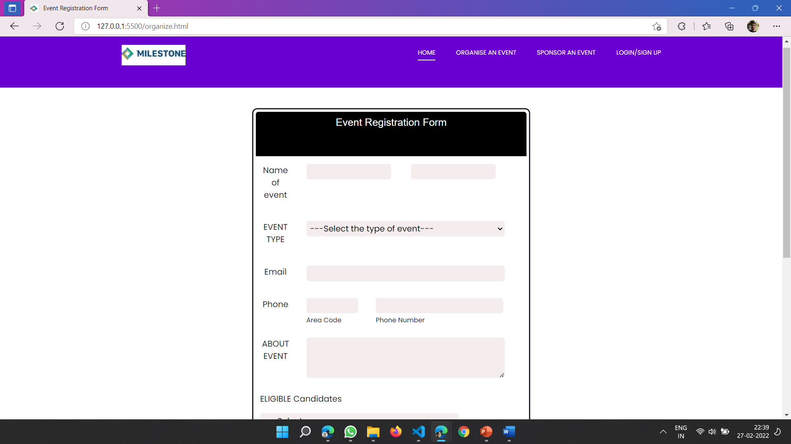
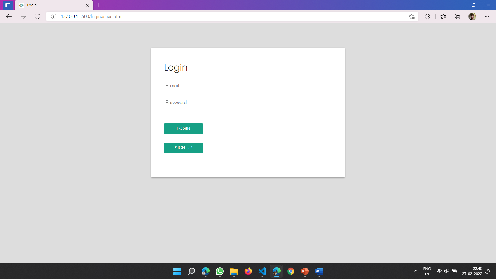
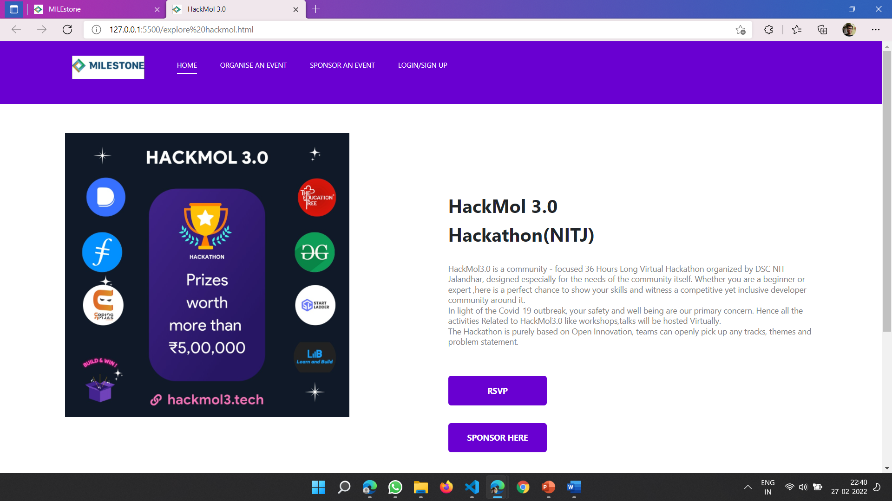
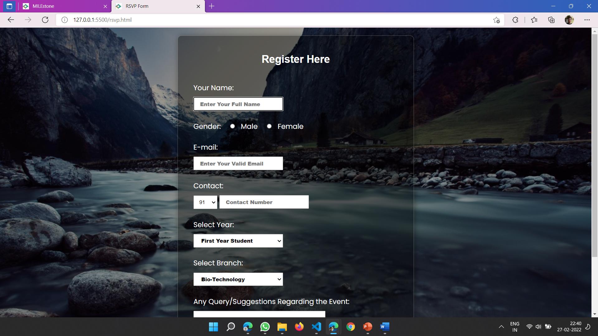
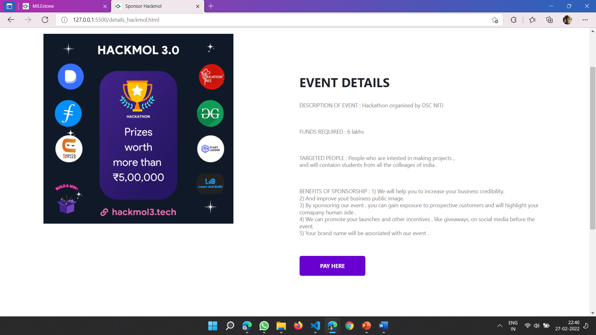
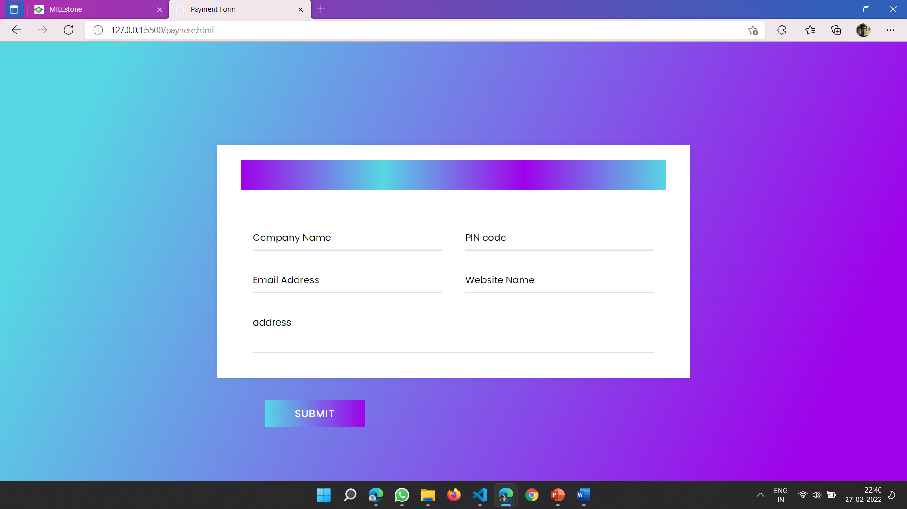
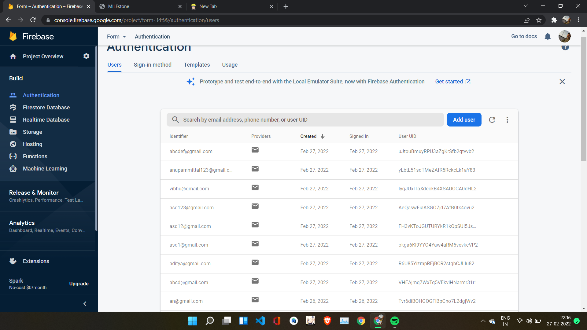

# MILEstone-Hackmol-3.0
Charged by Codes 
Tech Stack used is 
- HTML
- CSS
- Javascript
- FireBase

 Team details
- Team Code : 3c46cbe82c
- Team Name : Charged by Codes 
- IsFresher: True

### Description of Idea

- IDea : To organise , sponsor and attend an event 
- Problem : A platform for enents is must 

As sponsors are required for every type of event in college but it's a very tough task to find sponsors just in return of their logo pasted on our website .
A platform is required where all college events must be well maintained .
so,
We have put a small effort to find sponsors and it is easy for sponsors to check every detail of event , sometimes sponsors also need publicity so this website will keep them updated with upcoming events also .
In Future,
This platform provides student an ease to join and attend all events of their choice .
College will get popularity and events will be organized on large scale with more bright minds.
The project may be extended for other colleges too.

### Images

Video link/embed

https://youtu.be/eqnYLnzTqgs

Thank You 

